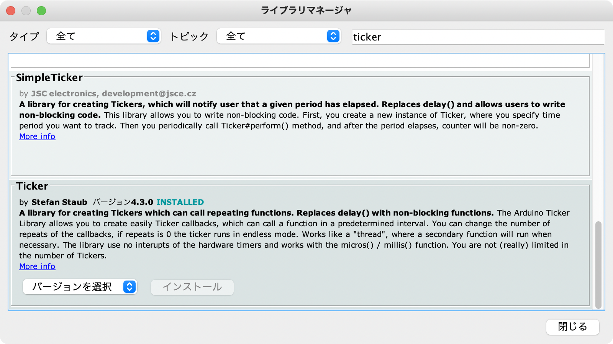

# Arduino 実装について

このディレクトリは、UART から制御信号を受け取りモーターコントローラーおよびタミヤ・ツインモーターギヤーボックスの制御を行う Arduino 向け実装が入っています。

 - `f`: 前進
 - `b`: 後進
 - `r`: 右に旋回
 - `l`: 左に旋回

# 使用方法

1. Ticker を「ツール」メニュー→「ライブラリを管理…」より追加する

    

2. 書き込む

# 解説

このプログラムでは、以下のような処理が行われます:

 - UARTから受け取った文字から enum `operation_t` をルックアップして `operation` 変数に格納する
 - 10ms ごとに呼び出される `adjust_output` 関数内で `operation` の内容に応じてモーターA/BのH/Lとスピード調整の PWM 出力を変化させる
 - PWM の出力デューティー比は定数 `max_duty` で決定される
   - デューティー比は最小0（ずっとLow）最大255（ずっとHigh）
   - 最大出力だとモーターのノイズが大きすぎて USB が切断される可能性が高い
   - USB に影響が出ない程度のデューティー比として128にしている（個体差があるかも）
 - 突然モーターを始動すると電源不足に陥る場合があるので `interpolate` 関数で一定の加速度で変化させる

